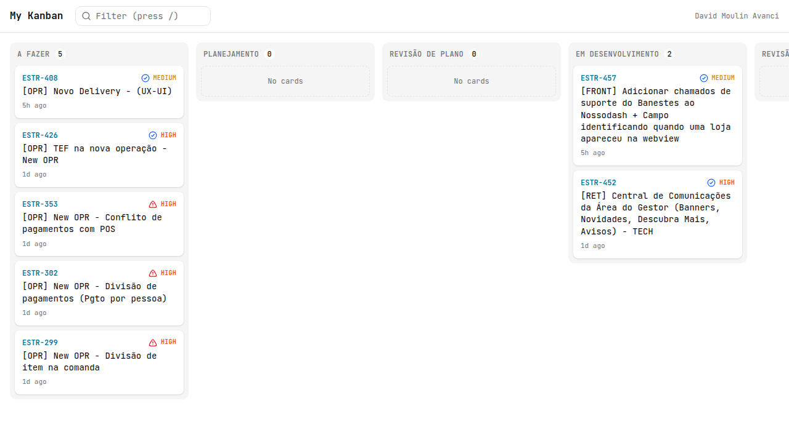

# Mega Brain

O Mega Brain é um quadro local para organizar e executar trabalho de software
assistido por IA. Cada card pode reunir contexto, conversas, alterações em Git,
worktrees, checklists, ambientes de desenvolvimento e pull requests sem tirar do
desenvolvedor o controle sobre os arquivos e comandos executados.



> O projeto está em desenvolvimento e, atualmente, tem como ambiente principal
> Windows 11 com WSL2. O shell desktop roda no Windows; o backend e as ferramentas
> de desenvolvimento dos projetos operam no WSL.

## O que o projeto oferece

- board local baseado em pastas e arquivos;
- cards com plano, chat, diff e acompanhamento do trabalho;
- execução de etapas por Claude Code ou Codex CLI;
- criação e gerenciamento de worktrees Git por tarefa;
- abertura de projetos no editor configurado;
- inicialização de ambientes locais de frontend e backend;
- integração opcional com Jira e GitHub CLI;
- aplicativo desktop para Windows construído com Tauri 2;
- modo web com React e Vite para desenvolvimento.

## Arquitetura resumida

```text
Mega Brain Desktop (Windows / Tauri)
├── React + Vite na WebView2
├── supervisor em Rust
│   └── inicia, valida e encerra o backend
└── backend Node no WSL
    ├── workspace e cards
    ├── Git e worktrees
    ├── Claude Code ou Codex CLI
    ├── Jira e GitHub CLI
    └── processos dos ambientes de desenvolvimento
```

O backend escuta apenas em `127.0.0.1` e usa um token efêmero por sessão. A
WebView não recebe acesso genérico a shell ou ao sistema de arquivos. Consulte
[server/README.md](./server/README.md) para detalhes do protocolo e da segurança
do backend.

## Pré-requisitos

### Para o aplicativo desktop

- Windows 11;
- WSL2 com uma distribuição Linux configurada;
- Node.js 20 e npm no Windows;
- Rust 1.77.2 ou mais recente;
- ferramentas de compilação MSVC do Visual Studio Build Tools;
- WebView2, normalmente já presente no Windows 11.

### Dentro do WSL

- Node.js 18.19 ou mais recente;
- Git;
- `bash` e `sh`;
- acesso de leitura e escrita aos diretórios escolhidos para cards e worktrees.

Recursos opcionais exigem suas ferramentas correspondentes:

- Claude Code para chat e etapas com Claude;
- Codex CLI para etapas com ChatGPT;
- GitHub CLI (`gh`) para operações com pull requests;
- Docker para os ambientes locais que dependem de banco de dados ou Redis;
- Cursor, VS Code ou outro editor para abrir os projetos pela interface;
- credenciais do Jira para sincronização de status.

Veja a lista detalhada em
[docs/architecture/wsl-prerequisites.md](./docs/architecture/wsl-prerequisites.md).

## Começando

O checkout usado para desenvolver o aplicativo desktop deve ficar no sistema de
arquivos do Windows. Abra o PowerShell e execute:

```powershell
git clone <URL_DO_REPOSITORIO>
cd mega-brain
npm ci
npm run tauri:dev
```

`tauri:dev` compila o backend, inicia ou reutiliza o Vite em
`http://127.0.0.1:15173` e abre o aplicativo Windows. Esse comando deve ser
executado pelo PowerShell, não pelo WSL ou WSLg.

Na primeira abertura, o onboarding solicitará:

1. o editor de código;
2. o diretório onde os cards serão armazenados;
3. a raiz onde as worktrees serão criadas;
4. Claude ou ChatGPT como provedor de IA.

Use caminhos absolutos do ambiente no qual o backend opera. Para a versão
desktop, os diretórios de cards e worktrees normalmente são caminhos POSIX do
WSL, como `/home/usuario/mega-brain-files/workspace`.

### Executar somente o modo web

```sh
npm run dev
```

O modo web preserva o frontend e os adaptadores Vite usados durante o
desenvolvimento. O caminho suportado para validar a integração completa
Windows → WSL é `npm run tauri:dev`.

## Comandos úteis

| Comando                | Finalidade                                                                 |
| ---------------------- | -------------------------------------------------------------------------- |
| `npm run dev`          | Inicia React/Vite em modo web.                                             |
| `npm run build`        | Executa o TypeScript e gera o frontend de produção.                        |
| `npm test`             | Executa a suíte Vitest.                                                    |
| `npm run server:dev`   | Inicia o backend Node com recarga automática.                              |
| `npm run server:build` | Gera o bundle independente do backend.                                     |
| `npm run server:test`  | Executa apenas os testes do backend.                                       |
| `npm run tauri:dev`    | Abre o aplicativo desktop em desenvolvimento.                              |
| `npm run tauri:build`  | Gera o aplicativo Tauri; o instalador final deve ser produzido no Windows. |

Para executar um teste específico:

```sh
npm test -- caminho/do/arquivo.test.ts
```

Para validar somente os tipos sem gerar artefatos:

```sh
npx tsc --noEmit
```

## Configuração

As preferências comuns e as credenciais do Jira são editadas pela própria
interface. O token do Jira é salvo no arquivo local de preferências com acesso
restrito e nunca é devolvido nas respostas da API. Variáveis de ambiente
continuam disponíveis para integrações e automação e têm precedência sobre as
credenciais salvas:

| Variável                   | Uso                                   |
| -------------------------- | ------------------------------------- |
| `WORKSPACE_DIR`            | Diretório padrão dos cards.           |
| `MEGA_BRAIN_WORKTREES_DIR` | Diretório das worktrees gerenciadas.  |
| `JIRA_SITE`                | URL da instância Jira.                |
| `JIRA_EMAIL`               | Conta usada na API do Jira.           |
| `JIRA_API_TOKEN`           | Token da API do Jira.                 |
| `MEGA_BRAIN_CLAUDE_BIN`    | Caminho alternativo para Claude Code. |
| `MEGA_BRAIN_CODEX_BIN`     | Caminho alternativo para Codex CLI.   |
| `MEGA_BRAIN_GIT_BIN`       | Caminho alternativo para Git.         |

Não versione `.env.local`, tokens, credenciais, conteúdo de `~/.claude` nem
dados pessoais de workspaces. Novas configurações sensíveis também não devem
ser gravadas nos logs.

## Worktrees e dependências

O Mega Brain mantém os checkouts das tarefas separados dos repositórios
principais. Quando possível, uma worktree recebe um link para o `node_modules`
do checkout canônico, evitando uma instalação completa para cada card.

O ambiente de desenvolvimento pula a instalação quando `node_modules` existe,
o gerenciador de pacotes é o mesmo e os lockfiles da worktree e do checkout
principal são idênticos. Se o lockfile estiver ausente ou diferente, a
instalação continua sendo necessária.

Alguns cuidados:

- não execute `npm install` ou `yarn install` por hábito dentro de toda
  worktree;
- antes de alterar dependências, verifique se `node_modules` é um link;
- mudanças em `package.json` devem incluir o lockfile correspondente;
- não compartilhe `node_modules` entre Windows e WSL;
- não compartilhe dependências entre máquinas, arquiteturas ou versões
  incompatíveis do Node;
- dependências nativas, como Rollup e esbuild, possuem binários específicos da
  plataforma.

Ao criar manualmente uma worktree do próprio Mega Brain, reutilize dependências
somente se ela for executada no mesmo sistema operacional e tiver o mesmo
lockfile. Caso contrário, faça uma instalação independente.

## Fazendo suas próprias alterações

Antes de começar, leia [PLAN.md](./PLAN.md) e os documentos relacionados à área
que será alterada. O plano registra decisões arquiteturais que nem sempre ficam
óbvias olhando apenas para o código.

Um fluxo recomendado é:

```sh
git switch -c feature/minha-alteracao
```

1. descreva o comportamento esperado antes de editar;
2. localize os testes e contratos existentes da área;
3. faça uma alteração pequena e focada;
4. acrescente ou atualize testes;
5. execute primeiro os testes diretamente relacionados;
6. execute `npx tsc --noEmit`, `npm test` e `npm run build` conforme o risco;
7. revise `git diff` e confirme que nenhum segredo ou arquivo não relacionado
   entrou na alteração;
8. use commits pequenos, com uma intenção clara por commit.

Para mudanças no shell desktop, execute também:

```sh
cargo test --manifest-path src-tauri/Cargo.toml
```

Builds do instalador NSIS devem ser feitos no Windows nativo. Consulte
[docs/desktop/windows-packaging.md](./docs/desktop/windows-packaging.md).

### Onde alterar

| Área                                | Diretório ou arquivo principal |
| ----------------------------------- | ------------------------------ |
| Interface React                     | `src/`                         |
| Estilos globais                     | `src/index.css`                |
| Cliente HTTP/SSE                    | `src/apiClient.ts`             |
| Backend Node                        | `server/`                      |
| Regras de worktree e etapas         | `scripts/`                     |
| Orquestração dos ambientes locais   | `devEnv.ts`                    |
| Shell e supervisor desktop          | `src-tauri/`                   |
| Decisões e validações arquiteturais | `docs/`                        |

## Alterações por vibe coding

Vibe coding funciona melhor neste projeto quando a IA recebe contexto e limites
claros. Peça que ela investigue antes de editar e mantenha você responsável pela
decisão final.

Um bom prompt inicial é:

```text
Leia o README, o PLAN.md e a documentação da área afetada. Inspecione o código
e os testes existentes antes de modificar qualquer arquivo. Faça somente a
alteração solicitada, preserve mudanças não relacionadas e não acesse serviços
reais ou credenciais. Acrescente testes focados, rode as validações relevantes
e apresente um resumo do diff, dos testes executados e de qualquer limitação.
```

Boas práticas ao trabalhar com um agente:

- dê um objetivo observável, não apenas “melhore isso”;
- informe quais arquivos, integrações e dados estão fora do escopo;
- peça um diagnóstico separado antes de autorizar correções arriscadas;
- não permita comandos destrutivos sem revisar o caminho exato atingido;
- não cole tokens, `.env`, cookies, logs sensíveis ou dados reais no prompt;
- prefira fixtures temporárias e serviços falsos nos testes;
- peça testes de regressão para todo bug corrigido;
- confira o diff em vez de aceitar apenas o resumo da IA;
- execute localmente o fluxo principal antes de integrar uma mudança ampla;
- trate código gerado como contribuição não revisada até entender seu
  comportamento.

A suíte instala guardrails que impedem testes comuns de chamar Claude, shells de
rede, Jira real ou workspaces fora do diretório temporário. Eles reduzem riscos,
mas não substituem revisão humana nem constituem um sandbox completo. Veja
[docs/architecture/test-safety-guardrails.md](./docs/architecture/test-safety-guardrails.md).

## Documentação adicional

- [Desenvolvimento local do Tauri](./docs/desktop/local-development.md)
- [Empacotamento para Windows](./docs/desktop/windows-packaging.md)
- [Pré-requisitos do WSL](./docs/architecture/wsl-prerequisites.md)
- [Contrato do runtime WSL](./docs/architecture/wsl-runtime-contract.md)
- [Integrações Windows/WSL](./docs/architecture/platform-integrations-wsl.md)
- [Backend Node](./server/README.md)

## Licença

Este repositório ainda não contém um arquivo de licença. Antes de redistribuir,
publicar uma versão derivada ou aceitar contribuições externas, defina com os
mantenedores os termos de uso e adicione uma licença explícita ao projeto.
