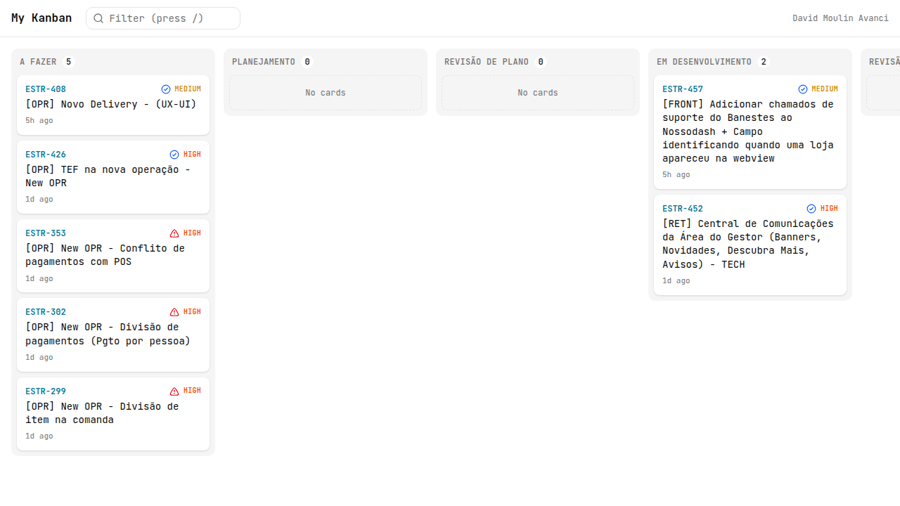

# Mega Brain

O Mega Brain é um gerenciador de projetos com IA. Em termos simples, é uma interface para organizar tarefas e trabalhar de forma mais automatizada com seus repositórios locais. Cada tarefa vira um card em um quadro: você acompanha o planejamento, a implementação, a revisão e a entrega, enquanto o aplicativo reúne conversas com a IA, arquivos gerados, diffs, worktrees e links de pull requests.

> **Aviso:** este projeto é 100% _vibe coded_. Pode haver _AI slop_: código, textos ou comportamentos gerados por IA que ainda precisam de revisão. Confira as alterações e os comandos antes de usá-los em projetos importantes.



_Exemplo do quadro com tarefas, progresso e consumo do Claude fictícios._

## Como funciona

Crie um card com título, descrição e nível de fluxo. Você pode associá-lo a repositórios locais e movê-lo entre as colunas do quadro. Ao entrar em uma coluna com automação, o backend inicia a etapa correspondente; o andamento e eventuais erros aparecem no card. O aplicativo também permite abrir o projeto no editor escolhido, conversar com o agente, inspecionar o diff e iniciar ambientes locais de desenvolvimento.

| Coluna                | O que acontece ao colocar um card nela                                                                                                                                                  |
| --------------------- | --------------------------------------------------------------------------------------------------------------------------------------------------------------------------------------- |
| **A fazer**           | O card fica na fila, sem iniciar uma etapa automática.                                                                                                                                  |
| **Planejando**        | A IA prepara os arquivos de planejamento e a checklist de implementação. No fluxo completo, também prepara a checklist de testes. Ao terminar, o card avança conforme o nível de fluxo. |
| **Revisão de plano**  | O plano fica disponível para revisão e ajustes antes da implementação. A movimentação para a próxima etapa é manual.                                                                    |
| **Desenvolvendo**     | O agente executa os itens da checklist de implementação nos repositórios da tarefa. Ao terminar, avança para testes no fluxo completo ou para Code Review nos demais fluxos.            |
| **Auto Testing**      | O agente executa a checklist de testes e, ao concluir, leva o card para Code Review. Essa etapa faz parte do fluxo completo.                                                            |
| **Code Review**       | Você revisa o diff e o resultado da tarefa. O card aguarda uma decisão manual para seguir.                                                                                              |
| **Staging**           | A automação prepara as alterações e abre pull requests para a branch staging dos repositórios associados. Requer GitHub CLI e acesso ao remoto.                                         |
| **Aguardando deploy** | A automação abre pull requests para a branch principal dos repositórios e registra a janela prevista de deploy. Requer GitHub CLI e acesso ao remoto.                                   |
| **Produção**          | Marca a entrega como concluída no quadro; não inicia um agente.                                                                                                                         |

Os níveis de fluxo ajustam as etapas: **Simples** gera apenas a checklist de implementação e pula revisão de plano e testes automáticos; **Médio** gera plano e checklist de implementação, com revisão de plano; **Difícil** inclui plano, revisão e testes automáticos. A movimentação do card pode sincronizar o status com o Jira quando a integração estiver configurada.

## Stack

| Camada                | Tecnologias                                                                            |
| --------------------- | -------------------------------------------------------------------------------------- |
| Interface             | React 19, TypeScript, Vite 6, Tailwind CSS 4 e componentes shadcn/Base UI              |
| Quadro                | @dnd-kit para arrastar cards entre colunas                                             |
| Backend               | Node.js, TypeScript e API HTTP/SSE local                                               |
| Desktop               | Tauri 2, Rust e WebView2                                                               |
| Projetos e automações | Git, worktrees, Claude Code ou Codex CLI; GitHub CLI e Jira como integrações opcionais |

Os cards e as preferências ficam em arquivos locais. O backend do aplicativo desktop roda nativamente no macOS e no WSL no Windows, atendendo apenas em 127.0.0.1; veja [a documentação do backend](./server/README.md) para detalhes.

## Compatibilidade atual

| Área                    | Compatibilidade                                                                                                                                                                                                                                   |
| ----------------------- | ------------------------------------------------------------------------------------------------------------------------------------------------------------------------------------------------------------------------------------------------- |
| Sistema operacional     | Aplicativo desktop para **Windows 11 com WSL2** e **macOS**. No macOS, o backend roda localmente com um runtime Node.js incluído no pacote. O frontend também pode rodar no navegador para desenvolvimento. Linux desktop não está habilitado. |
| Editores                | Detecção de Cursor, VS Code, Windsurf, Zed, Sublime Text, IntelliJ IDEA, WebStorm e PyCharm. Também é possível informar o comando de outro editor. O editor precisa estar instalado e acessível no ambiente configurado.                          |
| IA                      | **Claude** via Claude Code ou **ChatGPT** via Codex CLI, selecionados nas configurações. As ferramentas correspondentes precisam estar instaladas e autenticadas no ambiente local escolhido para usar chat e etapas automáticas.                                      |
| Repositórios e serviços | Repositórios Git locais; GitHub CLI (gh) para pull requests; Jira opcional para importar tarefas e sincronizar status.                                                                                                                            |

## Rodar localmente

### Windows

- Windows 11 com WSL2 e uma distribuição Linux configurada;
- Node.js 20 e npm no Windows; Node.js 18.19 ou superior, Git, bash e sh no WSL;
- Rust 1.88 ou superior, ferramentas MSVC do Visual Studio Build Tools e WebView2 no Windows;
- Claude Code ou Codex CLI no WSL para os recursos de IA;
- GitHub CLI no WSL se você quiser criar e acompanhar pull requests.

Mantenha o checkout do aplicativo no sistema de arquivos do Windows. No **PowerShell**:

```powershell
git clone <URL_DO_REPOSITORIO>
cd mega-brain
npm ci
npm run tauri:dev
```

O comando compila o backend, inicia o Vite e abre o aplicativo desktop. Execute-o no PowerShell. Na primeira abertura, escolha o editor, a pasta dos cards, a pasta das worktrees e o provedor de IA. Para cards e worktrees, use caminhos absolutos do WSL, por exemplo /home/usuario/mega-brain-files/workspace.

### macOS

- macOS com Xcode Command Line Tools, Rust 1.88 ou superior, Node.js e npm;
- Git e as ferramentas que você quiser usar com os agentes (Claude Code, Codex CLI, GitHub CLI) instalados e autenticados no macOS.

```sh
git clone <URL_DO_REPOSITORIO>
cd mega-brain
npm ci
npm run tauri:dev
```

O comando inicia o Vite e o backend local e abre a janela Tauri. Para gerar o aplicativo e o instalador DMG, execute `npm run tauri:build`. O runtime Node.js é incluído no pacote; cada build usa a arquitetura da máquina que o gerou.

Os botões **Rodar com agente** e **Abrir terminal** usam o Terminal do macOS por padrão. Em **Configurações → Shell e terminal**, selecione **Automático**, **Terminal do macOS** ou **iTerm2**. Também são aceitos os caminhos absolutos de `Terminal.app` e `iTerm.app`, inclusive o executável dentro do aplicativo. Um terminal personalizado deve aceitar `-e` seguido do comando e seus argumentos. No Windows/WSL, a seleção automática continua usando o Windows Terminal e abre a distribuição do backend. O shell opcional aceita Zsh, Bash ou outro executável compatível com POSIX e `-lc`; ele carrega o ambiente de login antes de executar o agente.

A variável `MEGA_BRAIN_TERMINAL_BIN`, quando definida no ambiente do backend, tem prioridade sobre a preferência salva. Os comandos abrem na pasta do card, com o PATH do backend disponível. No Mac, o lançamento usa um arquivo `.command` privado, removido ao iniciar; arquivos não executados são removidos após cinco minutos ou ao encerrar o backend. Não é necessário conceder permissão de automação para controlar o terminal.

Os links dos ambientes locais e dos pull requests usam o navegador padrão do macOS. Para escolher outro navegador, `MEGA_BRAIN_BROWSER_BIN` aceita o caminho de um aplicativo `.app` ou de um executável; aplicativos `.app` seguem as preferências de janelas e abas do navegador.

**Iniciar ambiente dev** abre uma prévia dos projetos detectados, com pasta, comando e porta. Selecione os projetos que deseja executar e ajuste as portas antes de iniciar. Também é possível subir apenas o backend; frontends cadastrados aparecem como opções quando só as APIs legadas foram alteradas. Portas inválidas, repetidas ou já ocupadas impedem a execução. A seleção, as portas e a opção de Docker são preservadas para a próxima tentativa do card.

No macOS, **Iniciar containers Docker** fica desmarcado por padrão. Ative a opção se quiser iniciar os containers das APIs legadas. Com ela desmarcada, o backend usa o banco e o Redis já configurados no ambiente local. O botão de tentar novamente reabre a configuração para corrigir a seleção ou as portas.

O build macOS gera o DMG sem automatizar o Finder, evitando que permissões de automação ou a sessão gráfica interrompam o empacotamento. A imagem mantém o aplicativo e o link para Applications, com o layout padrão do Finder. Para usar o posicionamento visual do Tauri, execute `TAURI_BUNDLER_DMG_IGNORE_CI=true npm run tauri:build` em uma sessão gráfica com permissão para controlar o Finder.

Para trabalhar apenas na interface web durante o desenvolvimento:

```sh
npm ci
npm run dev
```

O modo web usa os adaptadores de desenvolvimento do Vite; para conferir a integração completa com o backend no WSL, use o aplicativo desktop.

O ícone de cérebro na interface e no favicon acompanha a paleta escolhida. No aplicativo Windows, o ícone da janela também é atualizado durante a execução; o ícone do instalador e dos atalhos permanece o ícone definido no build. A atualização da barra de tarefas precisa ser conferida na versão empacotada.

## Documentação

- [Desenvolvimento local do Tauri](./docs/desktop/local-development.md)
- [Pré-requisitos do WSL](./docs/architecture/wsl-prerequisites.md)
- [Empacotamento para Windows](./docs/desktop/windows-packaging.md)
- [Backend e segurança](./server/README.md)

## Licença

Este repositório ainda não contém um arquivo de licença. Consulte os mantenedores antes de redistribuir ou publicar uma versão derivada.

## Triagem experimental de cards

Consulte [a integração Jev (TypeSafe)](docs/integrations/jev-card-triage.md) para configuração, limites e avaliação.

### Pausar e retomar um card

O controle de pausa no card e no detalhe da task encerra os agentes da etapa gerenciados pelo Mega-Brain e salva a execução. Aguarde o card mostrar **Agentes pausados · progresso salvo** antes de fechar o app. Ao abrir novamente, use **Retomar agentes deste card** para continuar na mesma etapa, com os checklists, arquivos e worktrees preservados. Os agentes Claude e Codex retomam a sessão salva quando ela já foi criada. Itens concluídos não são executados novamente.

A retomada mantém o provedor, modelo, esforço e perfil Codex usados na execução original. Retome o card antes de iniciar outra execução na mesma pasta. Para mudar a etapa ou o fluxo, retome ou interrompa a execução primeiro; a ação de interrupção continua restaurando os artefatos da etapa. Agentes abertos independentemente no terminal têm seu próprio ciclo de execução.
