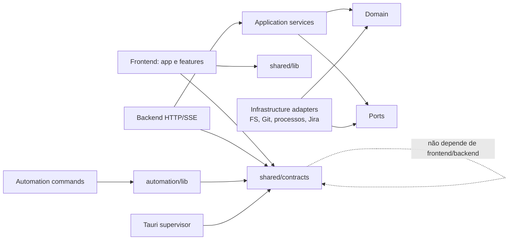

# Plano de refatoração sistêmica do Mega Brain

**Status:** proposta executável  
**Data da análise:** 2026-09-16  
**Escopo:** frontend React/Vite, backend Node, automações, shell Tauri, testes, dependências e documentação  
**Documento relacionado:** `PLAN.md` continua sendo a fonte do roadmap do produto desktop; este plano trata da saúde interna do código.

## 1. Resultado esperado

Refatorar o Mega Brain de forma incremental para que:

- cada área de negócio tenha um lugar previsível e uma API interna explícita;
- frontend, backend, automações e shell desktop não dependam de detalhes internos uns dos outros;
- arquivos grandes sejam decompostos por responsabilidade, não por tamanho arbitrário;
- código, exports, arquivos e dependências sem consumidores sejam removidos com evidência;
- mudanças de arquitetura sejam protegidas por lint, análise estática, testes e CI;
- os contratos HTTP/SSE, a segurança de loopback, a supervisão de processos e a compatibilidade Windows–WSL permaneçam estáveis durante a migração;
- o repositório tenha baseline reproduzível, histórico e rollback antes de qualquer limpeza ampla.

Este não é um redesenho do produto nem uma reescrita. A estratégia é substituir partes internamente, mantendo as fronteiras externas estáveis.

## 2. Diagnóstico do estado atual

### 2.1 Evidências coletadas

| Evidência | Estado observado | Consequência |
| --- | --- | --- |
| Histórico Git | A fonte canônica está em uma branch `master` sem commits; todos os arquivos aparecem como `untracked` | Bloqueia refatoração segura: não há diff confiável, rollback ou bisect |
| Tamanho | 17.222 linhas em 159 arquivos TS/TSX/MJS/Rust nas áreas analisadas | Projeto ainda comporta uma reorganização incremental, sem exigir monorepo |
| Testes | 48 arquivos de teste TS encontrados; há também testes Rust inline | Boa base de proteção, mas não há métrica de cobertura |
| TypeScript | `npx tsc --noEmit --pretty false` passou em 2026-09-16 | O baseline de tipos está saudável |
| Vitest no WSL | A suíte não iniciou: o `node_modules` do checkout é Windows e não contém `@rollup/rollup-linux-x64-gnu` | É preciso tornar o ambiente de validação reproduzível por SO antes de usar os testes como gate |
| CI | Existe somente workflow de release Windows por tag ou disparo manual | Pull requests não recebem gate automático de qualidade |
| Dependências internas | A análise estática local não encontrou ciclos de imports | Deve permanecer em zero e virar regra automatizada |
| Fronteiras | Sete arquivos de produção do backend importam tipos de `src/`; workspace importa módulos soltos da raiz | Backend e frontend não são estruturalmente independentes |
| Gerenciador de pacotes | `package-lock.json` e `yarn.lock` coexistem; scripts e CI usam npm | Instalações podem divergir e gerar ruído de lockfile |
| Qualidade | `strict`, `noUnusedLocals` e `noUnusedParameters` já estão ativos; ESLint, formatter, Knip e cobertura não estão configurados | Há boa base do compilador, mas faltam guardrails arquiteturais e de código morto |

### 2.2 Hotspots prioritários

| Arquivo/área | Sinal | Refatoração proposta |
| --- | --- | --- |
| `server/workspace/service.ts` | 1.184 linhas / ~50 KB; mistura cards, estágios, agentes, Git/worktrees, diffs, launchers e ambientes dev | Separar por casos de uso e adaptadores, mantendo `workspaceHttp` como fachada temporária |
| `devEnv.ts` | 607 linhas; configuração específica de projetos, planejamento, dependências, portas, processos e persistência | Criar módulo `dev-environments` com `planner`, `repository`, `process-supervisor` e perfis de projeto |
| `server/main.ts` | 583 linhas; listener, auth/CORS, limits, body parser, SSE, diagnostics, lifecycle e sinais | Extrair infraestrutura HTTP sem alterar o protocolo do supervisor |
| `src/cards.ts` | 448 linhas; store, polling, mapeamento, migração, Jira e todos os comandos da API | Separar `store`, `queries`, `commands`, `mappers` e integração Jira |
| `src/CardModal.tsx` | 459 linhas e vários subcomponentes | Mover para `features/cards/detail/` e dividir cabeçalho, ações, PRs e conteúdo |
| `src/CardView.tsx` | 421 linhas; apresentação, agentes, reset, PR e exclusão | Separar componentes por comportamento e manter a composição na feature de cards |
| `src/DiffTab.tsx` | 380 linhas; parsing, virtualização, navegação e renderização | Separar modelo de linhas/virtualização de componentes visuais |
| `src/SettingsDialog.tsx` | 307 linhas; carregamento, estado, modelos e apresentação | Criar feature de settings com formulário, catálogo de modelos e hook de persistência |
| `src/index.css` | 451 linhas globais | Manter tokens/reset globais e aproximar estilos específicos das features |
| raiz do projeto | módulos de aplicação e testes misturados com configurações | Deixar na raiz apenas metadados e arquivos de configuração |

### 2.3 Acoplamentos que devem ser removidos

1. `server/*` importa contratos de `src/types.ts`. Tipos compartilhados não podem pertencer ao frontend.
2. `server/workspace/service.ts` importa `devEnv.ts` e `prStatus.ts` da raiz.
3. `server/chat/service.ts` importa utilidades internas de `server/workspace/service.ts`.
4. `scripts/master-pr.ts` importa uma regra de janela de deploy de `src/deployWindow.ts`.
5. `viteApiAdapter.ts` conhece formatação específica de chat em vez de depender somente de contratos de transporte.
6. `server/workspace/service.ts` e `scripts/lib/workspace.ts` duplicam conceitos como `slugify`, leitura de `card.json` e regras de workspace.

## 3. Decisões de arquitetura

### 3.1 Estratégia

- **Monólito modular primeiro.** Não criar packages/workspaces npm enquanto diretórios e regras de import forem suficientes.
- **Migração por costura.** Criar a nova API interna ao lado da antiga, migrar consumidores e então remover a compatibilidade.
- **Contratos antes de implementação.** Tipos de transporte e modelos compartilhados ficam fora de `src/` e `server/`.
- **Domínio pragmático.** Criar interfaces/ports apenas para efeitos externos ou pontos realmente substituíveis; não envolver cada função pura em classe ou interface.
- **Features no frontend, módulos no backend.** Componentes, hooks, queries e testes de uma feature ficam próximos.
- **Raiz sem lógica de aplicação.** A raiz fica reservada a `package.json`, configs, README e documentos principais.
- **Uma fonte por regra.** Regras de slug, card, fluxo, deploy e worktree não podem ter cópias divergentes.
- **Remoção contínua.** Código morto é limpo em cada fase, depois da migração dos consumidores; não em um PR gigantesco no final.

### 3.2 Regra de dependências desejada



Regras verificáveis:

- `shared/**` não importa `src/**`, `server/**`, `scripts/**` ou APIs de Node/browser;
- `src/**` não importa `server/**`, `scripts/**` ou módulos Node;
- `server/**` não importa `src/**` ou componentes de automação;
- `server/modules/<módulo>` não importa detalhes internos de outro módulo; usa a API pública do módulo ou um contrato compartilhado;
- `scripts/commands/**` pode importar `scripts/lib/**` e `shared/**`, nunca o frontend;
- adaptadores externos dependem dos ports; casos de uso não dependem de `node:fs`, `node:child_process`, Tauri ou Vite;
- imports profundos atravessando módulos são proibidos.

### 3.3 Estrutura-alvo

Não é necessário criar todos os diretórios antecipadamente. Cada pasta nasce quando o primeiro conjunto de arquivos é migrado.

```text
mega-brain/
├── src/
│   ├── app/
│   │   ├── App.tsx
│   │   ├── bootstrap.ts
│   │   └── providers/
│   ├── features/
│   │   ├── board/
│   │   ├── cards/
│   │   │   ├── api/
│   │   │   ├── components/
│   │   │   ├── model/
│   │   │   └── tests/
│   │   ├── chat/
│   │   ├── dev-environments/
│   │   ├── settings/
│   │   └── deploy-prs/
│   └── shared/
│       ├── api/
│       ├── hooks/
│       ├── lib/
│       ├── styles/
│       └── ui/
├── shared/
│   ├── contracts/
│   └── domain/
├── server/
│   ├── app/
│   │   ├── bootstrap.ts
│   │   ├── runtime.ts
│   │   └── routes.ts
│   ├── http/
│   │   ├── auth.ts
│   │   ├── cors.ts
│   │   ├── json-body.ts
│   │   ├── limits.ts
│   │   └── sse.ts
│   ├── modules/
│   │   ├── cards/
│   │   ├── agents/
│   │   ├── chat/
│   │   ├── dev-environments/
│   │   ├── jira/
│   │   ├── usage/
│   │   └── coffee/
│   ├── platform/
│   │   ├── filesystem/
│   │   ├── git/
│   │   ├── process/
│   │   └── windows-wsl/
│   └── test-support/
├── scripts/
│   ├── commands/
│   └── lib/
├── test/
│   ├── fixtures/
│   └── support/
├── src-tauri/
├── docs/
└── configs e metadados na raiz
```

Observações:

- `shared/` deve ser pequeno. Ele não é um novo depósito de `utils` genéricas.
- Nem todo módulo precisa de subpastas `domain/application/infrastructure`. Elas só devem existir quando houver conteúdo suficiente para tornar o limite útil.
- Testes unitários podem ficar junto da implementação; fixtures e harnesses reutilizados ficam em `test/support`.
- `src-tauri/` já tem uma separação razoável entre `supervisor`, `runtime_contract` e shell. Alterações ali devem priorizar contratos, lifecycle e segurança, não reorganização cosmética.

## 4. Plano de execução

### Fase 0 — Baseline recuperável e ambiente reproduzível

**Objetivo:** tornar possível refatorar sem perder código ou confundir falha de ambiente com regressão.

1. Verificar a origem correta do repositório e recuperar/importar o histórico existente, se houver.
2. Se não houver histórico recuperável, revisar segredos e arquivos gerados, criar o primeiro commit imutável do estado atual e tagueá-lo como baseline.
3. Confirmar que `.env.local`, workspaces, credenciais, `node_modules`, `dist`, `src-tauri/target`, `tsconfig.tsbuildinfo` e artefatos temporários não entram no baseline.
4. Padronizar **npm**, pois README, scripts e CI já usam `npm ci`:
   - adicionar `packageManager` ao `package.json`;
   - manter somente `package-lock.json`;
   - remover `yarn.lock` apenas depois de validar `npm ci` limpo;
   - documentar que `node_modules` não pode ser compartilhado entre Windows e WSL.
5. Definir um fluxo local suportado por SO:
   - frontend/Tauri e release: Windows nativo;
   - backend/testes Linux: checkout ou worktree WSL com dependências Linux próprias;
   - CI: instalação limpa por job, nunca reutilizando módulos de outro SO.
6. Criar workflow de pull request com jobs separados para:
   - typecheck, lint, análise de código morto e testes Node em Linux;
   - build frontend/backend;
   - testes Rust e validações Windows necessárias.
7. Registrar o baseline: quantidade/duração de testes, cobertura inicial, tamanho do bundle, cold start conhecido e smoke tests críticos.

**Gate:** baseline commitado; `npm ci`, typecheck, testes e builds passam em ambientes suportados; PRs recebem status checks obrigatórios.

### Fase 1 — Guardrails de qualidade e arquitetura

**Objetivo:** impedir que a refatoração crie nova dívida enquanto remove a antiga.

1. Adicionar ESLint com configuração flat, TypeScript e regras React Hooks.
2. Usar `no-restricted-imports` para codificar as fronteiras da seção 3.2, começando em modo de erro para novas violações e com exceções temporárias explícitas para as sete violações atuais.
3. Adicionar formatter e `format:check`; formatar em PR dedicado para não misturar ruído com mudanças estruturais.
4. Adicionar Knip com entradas explícitas:
   - `src/main.tsx`;
   - `server/main.ts`;
   - `vite.config.ts`;
   - comandos reais em `scripts/`;
   - arquivos de teste e configuração em modo completo.
5. Executar duas análises Knip:
   - modo completo para arquivos, exports e dependências usados por testes/configuração;
   - `--production --strict` para código realmente alcançável em produção.
6. Ativar detecção de ciclos e manter o baseline atual de zero ciclos.
7. Adicionar cobertura Vitest com `coverage.include` abrangendo também arquivos nunca importados por testes.
8. Não impor 100% global. Definir baseline e política de ratchet: cobertura total não cai e todo módulo extraído recebe testes dos seus contratos e casos críticos.
9. Criar scripts compostos, por exemplo `quality` e `ci`, sem esconder qual etapa falhou.

**Gate:** CI rejeita novos imports proibidos, ciclos, código morto não justificado, falhas de tipo/lint/teste e queda de cobertura.

### Fase 2 — Extrair contratos compartilhados e corrigir a direção das dependências

**Objetivo:** frontend e backend compartilharem contratos sem um depender do outro.

1. Dividir `src/types.ts` em grupos coesos:
   - `shared/domain/cards.ts`;
   - `shared/domain/agents.ts`;
   - `shared/domain/settings.ts`;
   - `shared/contracts/chat.ts`;
   - `shared/contracts/api.ts`;
   - `shared/contracts/desktop.ts`.
2. Manter re-exports temporários em `src/types.ts` para evitar um PR massivo; remover o shim quando todos os consumidores migrarem.
3. Migrar os sete imports de produção `server -> src` para `shared`.
4. Mover `deployWindow.ts` para um módulo compartilhado sem dependência de React, eliminando `scripts -> src`.
5. Criar tsconfigs por ambiente — frontend DOM, backend Node, scripts/testes — e um tsconfig solution com project references.
6. Fazer o typecheck de cada ambiente com suas libs corretas; frontend não deve enxergar APIs Node por acidente.
7. Documentar contratos públicos e impedir imports internos profundos.

**Gate:** zero imports de produção entre `server/**` e `src/**`; cada ambiente typechecks isoladamente; contratos HTTP/SSE permanecem idênticos.

### Fase 3 — Modularizar o backend

**Objetivo:** decompor responsabilidades sem alterar rotas ou protocolo.

#### 3A. Workspace e cards

Extrair de `server/workspace/service.ts`, nesta ordem:

1. `cards/card-schema.ts`: parsing e validação de `card.json` a partir de `unknown`.
2. `cards/card-repository.ts`: listar, ler, criar, atualizar e excluir cards.
3. `agents/stage-catalog.ts`: estágios, perfis, prompts e configuração de modelo.
4. `agents/agent-state.ts`: leitura de PID, JSONL, progresso e detecção de erro.
5. `agents/stage-runner.ts`: comando, spawn, ownership, retry e snapshots.
6. `workspace/worktrees.ts`: registro, remoção e proteção de paths.
7. `workspace/diff-service.ts`: base de diff e arquivos não rastreados.
8. `platform/launchers.ts`: browser, editor e terminal.
9. `dev-environments/`: mover a integração hoje em `devEnv.ts`.

`createWorkspaceService` permanece como fachada e delega para esses casos de uso até as rotas migrarem. Cada extração deve ser behavior-preserving e acompanhada por testes antes de deletar a implementação antiga.

#### 3B. HTTP e lifecycle

Extrair de `server/main.ts`:

- `http/request-context.ts` e normalização segura de headers/route;
- `http/json-body.ts` e limites;
- `http/sse.ts` e cancelamento;
- `http/diagnostics.ts` para health/version;
- `app/lifecycle.ts` para start/stop/readiness;
- `app/signals.ts` para SIGINT/SIGTERM.

Manter `main.ts` como entrypoint curto de composição. Os testes de auth, CORS, limite, ready line, SSE e encerramento devem continuar sendo gates obrigatórios.

#### 3C. Adapters e tipos de entrada

1. Substituir `any` nos eventos Claude/Codex, respostas Jira e JSON persistido por `unknown` + parsers/narrowing.
2. Trocar `console.error` em serviços por logger injetado e redigido.
3. Fazer chat depender de um módulo explícito de transcritos/agentes, não de exports internos do workspace.
4. Consolidar `slugify`, leitura/gravação de cards e regras de paths compartilhadas com automações.
5. Não criar um filesystem abstrato universal; injetar somente as operações necessárias nos módulos em que testes determinísticos ou segurança justificarem.

**Gate:** entrypoints e fachadas têm apenas composição; módulos não atravessam limites internos; todos os contratos standalone/Vite e guardrails de segurança continuam verdes.

### Fase 4 — Organizar o frontend por feature

**Objetivo:** separar estado remoto, regras de apresentação e componentes sem trocar comportamento visual.

1. Mover `apiClient.ts` para `src/shared/api/` e mantê-lo como única fronteira de transporte.
2. Dividir `cards.ts` em:
   - `features/cards/api/cards-api.ts`;
   - `features/cards/model/cards-store.ts`;
   - `features/cards/model/card-mappers.ts`;
   - `features/cards/model/card-commands.ts`;
   - `features/cards/integrations/jira.ts`.
3. Manter a API pública do store durante a migração para evitar alterar todo o frontend de uma vez.
4. Mover componentes e utilidades para `features/board`, `features/cards`, `features/chat`, `features/settings`, `features/dev-environments` e `features/deploy-prs`.
5. Decompor `CardModal`, `CardView`, `DiffTab` e `SettingsDialog` pelos comportamentos listados nos hotspots.
6. Preservar `lazy`/`Suspense` nos painéis pesados; imports diretos e analisáveis para UI comum.
7. Auditar cada `useEffect`:
   - manter sincronização com rede, DOM, listeners e APIs externas;
   - mover lógica causada por interação para handlers;
   - calcular estado derivado durante render;
   - garantir cleanup de timer, listener, stream e request.
8. Manter em `index.css` apenas tokens, reset, layout base e estilos verdadeiramente globais; aproximar estilos específicos de suas features sem reescrever tudo em Tailwind.
9. Decidir explicitamente sobre TanStack Query. Recomendação inicial: remover os três pacotes atualmente sem uso e só reintroduzir uma solução de server state via ADR e migração coerente, não em uma tela isolada.

**Gate:** nenhum componente acessa `fetch` diretamente; features não conhecem internals umas das outras; componentes grandes viram composições; smoke visual e fluxos de board continuam equivalentes.

### Fase 5 — Consolidar automações e integrações de plataforma

**Objetivo:** remover lógica de aplicação da raiz e evitar regras duplicadas entre backend e scripts.

1. Mover comandos executáveis para `scripts/commands/` e manter `scripts/lib/` somente para bibliotecas sem side effect na importação.
2. Mover `devEnv.ts` para `server/modules/dev-environments/` e expor uma API interna usada pelo workspace.
3. Mover `prStatus.ts` para o módulo de GitHub/PR em `server/platform` ou `server/modules`.
4. Extrair perfis de projeto hoje hard-coded em `devEnv.ts` para configuração tipada e testável.
5. Unificar operações Git/processo em adapters compartilhados, sem permitir shell arbitrário.
6. Mover fixtures/harnesses de release para `test/support`.
7. Manter o Rust focado em supervisor, contrato do runtime e janela; só reorganizar quando uma mudança funcional exigir.

**Gate:** nenhuma lógica de produto `.ts` permanece na raiz; backend e scripts não duplicam regras de card/worktree; comandos podem ser importados em teste sem executar side effects.

### Fase 6 — Remover compatibilidade temporária e estabilizar

**Objetivo:** concluir a migração sem deixar duas arquiteturas permanentes.

1. Remover re-exports e fachadas temporárias depois que o último consumidor migrar.
2. Remover exceções arquiteturais do ESLint/Knip; a lista de exceções deve chegar a zero ou ter ADR explícita.
3. Atualizar README, mapa de diretórios, fluxo de contribuição e decisões arquiteturais.
4. Rodar matriz completa:
   - typecheck por ambiente;
   - lint e format check;
   - Knip completo e produção strict;
   - testes e cobertura;
   - build frontend/backend;
   - testes Rust;
   - contrato Vite/standalone;
   - E2E web/desktop e smoke Windows–WSL;
   - segurança de loopback, auth, CORS, traversal, redaction e lifecycle de processos.
5. Comparar bundle, startup, memória e tempo dos testes com o baseline; investigar regressões antes do cutover.

**Gate:** a estrutura-alvo é a única estrutura ativa; documentação e CI descrevem exatamente o repositório; não há camada temporária sem prazo/dono.

## 5. Protocolo de limpeza de código morto

Nenhum item deve ser removido só porque um `rg` não encontrou import. Entrypoints, imports dinâmicos, scripts, Tauri, arquivos lidos por path e consumidores externos exigem verificação.

Para cada lote:

1. Executar Knip completo e `knip --production --strict` com entradas corretas.
2. Confirmar com busca textual e grafo de imports.
3. Classificar o item:
   - morto em produção e teste;
   - usado apenas por teste;
   - entrypoint/configuração;
   - compatibilidade temporária;
   - API pública/documentada;
   - arquivo carregado dinamicamente;
   - gerado.
4. Migrar consumidores legítimos antes da exclusão.
5. Excluir em PR pequeno, junto com testes obsoletos, exports, dependências e documentação correspondentes.
6. Rodar gates direcionados e completos.
7. Registrar exceções do analisador com motivo e responsável; não usar glob amplo de ignore.

### 5.1 Candidatos identificados

| Candidato | Confiança | Ação proposta antes de remover |
| --- | --- | --- |
| `@tanstack/react-query`, `@tanstack/react-query-persist-client`, `@tanstack/query-sync-storage-persister` | Alta | Confirmar Knip produção e remover os três no mesmo PR |
| `src/components/ui/alert.tsx` | Alta | Confirmar que não há import dinâmico/gerador dependente; remover |
| `chatPlugin.ts`, `claudeUsagePlugin.ts`, `coffeePlugin.ts`, `jiraPlugin.ts`, `workspacePlugin.ts` | Alta para produção, média para exclusão | Hoje não são entradas do Vite; migrar testes dos re-exports para `server/modules`, substituir o guardrail estrutural e então remover |
| `server/index.ts` | Média | Como o package é privado e não declara exports, confirmar ausência de consumidor externo; remover ou torná-lo API pública real, não deixá-lo ornamental |
| `server/release-fixture.ts` | Não é morto; está deslocado | Mover para `test/support/server/` porque só um teste o importa |
| `codex-write-test.txt` vazio | Alta | Confirmar que é resíduo e excluir |
| `tsconfig.tsbuildinfo` | Alta como artefato | Adicionar ao ignore e não versionar |
| `yarn.lock` | Alta após decisão npm | Excluir somente depois de `npm ci` limpo e do baseline |
| pacote `shadcn` em `dependencies` | Média | Confirmar uso apenas como CLI; mover para `devDependencies` ou remover se os componentes já gerados não precisam dele |
| exports reexportados por plugins legados | Alta após migração de testes | Importar diretamente dos módulos proprietários e remover barrels de compatibilidade |

## 6. Sequência recomendada de PRs

Cada PR deve ser reversível e preservar comportamento, salvo quando declarar mudança funcional.

| PR | Escopo | Risco |
| --- | --- | --- |
| 0 | Recuperar/criar baseline Git, revisar secrets e artefatos | Alto, pré-condição |
| 1 | Padronizar npm, ambiente por SO e CI de pull request | Médio |
| 2 | ESLint/formatter/Knip/cobertura em modo baseline | Baixo a médio |
| 3 | Extrair `shared/contracts` e tsconfigs por ambiente | Médio |
| 4 | Migrar imports `server -> src` e `scripts -> src` | Médio |
| 5 | Remover dependências/arquivos mortos de alta confiança e plugins legados | Médio |
| 6 | Extrair cards/repository/schema de `workspace/service.ts` | Médio |
| 7 | Extrair stages/agents/worktrees/diff/launchers | Alto |
| 8 | Decompor `server/main.ts` preservando contratos HTTP/SSE/lifecycle | Alto |
| 9 | Modularizar `devEnv.ts` e consolidar Git/processos | Alto |
| 10 | Dividir `src/cards.ts` e organizar features do frontend | Médio |
| 11 | Decompor componentes hotspots e estilos por feature | Médio |
| 12 | Reorganizar comandos/test-support, remover shims e fechar documentação | Médio |
| 13 | Hardening final, E2E, métricas e remoção das últimas exceções | Alto |

PRs 6–11 podem ser subdivididos. Não devem ser executados em paralelo quando alterarem o mesmo contrato ou fachada.

## 7. Definition of Done de cada PR

- intenção e comportamento preservado descritos;
- diff focado, sem formatação ou renomeações alheias;
- testes de caracterização adicionados antes de mover lógica arriscada;
- typecheck, lint, análise Knip relevante e testes direcionados passam;
- suíte completa e build passam quando o ambiente permite;
- cobertura não cai sem justificativa explícita;
- nenhum novo `any` em fronteiras de JSON/processo/rede;
- nenhum novo import proibido ou ciclo;
- erros continuam redigidos e não vazam token, prompt, path ou credencial;
- contratos HTTP/SSE e lifecycle têm teste de regressão quando tocados;
- código/exports/dependências que ficaram sem consumidor no PR são removidos;
- documentação/ADR atualizados quando há decisão estrutural;
- plano de rollback é simplesmente reverter o PR, sem migração de dados destrutiva.

## 8. Métricas de sucesso

Medir tendência, não perseguir números cosméticos.

| Métrica | Baseline atual | Meta |
| --- | --- | --- |
| Commits recuperáveis | 0 no checkout analisado | Histórico e baseline imutável antes da Fase 1 |
| Ciclos estáticos | 0 na análise local | Permanecer em 0 no CI |
| Imports de produção `server -> src` | 7 | 0 após Fase 2 |
| Módulos de aplicação TS na raiz | Vários | 0 após Fase 5 |
| Dependências diretas sem uso confirmadas | Pelo menos 3 TanStack | 0, com exceções documentadas |
| Arquivos mortos confirmados | Candidatos, ainda sem gate reproduzível | 0 em modo produção Knip |
| `any` em fronteiras externas | Presente em Claude/Codex, Jira e JSON | 0 nos módulos migrados; redução contínua até 0 |
| Cobertura | Não configurada | Baseline publicado, sem regressão; contratos críticos explicitamente cobertos |
| Validação de PR | Ausente | Typecheck, lint, Knip, testes e builds obrigatórios |
| Paridade Vite/standalone | Testes existentes | Permanecer verde em toda extração backend |

Linhas por arquivo não são gate. Um arquivo deve ser dividido quando mistura motivos de mudança, efeitos externos ou conceitos, não apenas ao cruzar um limite numérico.

## 9. Riscos e controles

| Risco | Controle |
| --- | --- |
| Refatoração sem histórico apagar comportamento | Fase 0 bloqueante, baseline/tag e PRs pequenos |
| Testes passarem em um SO e falharem em outro | instalações limpas separadas por SO e matriz CI |
| Quebrar o handshake Tauri/backend | testes de ready line, version, health e smoke Windows–WSL |
| Quebrar SSE/cancelamento | contrato de framing, desconexão, abort e backpressure antes/depois de cada extração |
| Abrir acesso indevido a arquivos/processos | preservar path resolver, loopback, auth, CORS, ownership e guardrails de teste |
| Criar arquitetura excessivamente abstrata | ports somente para efeitos/variação reais; funções puras permanecem simples |
| Falso positivo de código morto | entradas explícitas, modo completo + produção, verificação dinâmica e PR isolado |
| Manter duas arquiteturas indefinidamente | cada shim tem issue/PR de remoção e gate na Fase 6 |
| Refatorar UI e comportamento juntos | primeiro mover/extrair com smoke visual; mudanças de UX em PR separado |
| Troca oportunista de biblioteca de estado | ADR específica; remover dependências não usadas antes de considerar adoção |

## 10. Pesquisas e fundamentos aplicados

- [TypeScript Project References](https://www.typescriptlang.org/docs/handbook/project-references): fundamenta tsconfigs menores, separação lógica e build mode por dependências.
- [ESLint `no-restricted-imports`](https://eslint.org/docs/latest/rules/no-restricted-imports): base para transformar as fronteiras de diretórios em regra executável.
- [Knip — configuração](https://knip.dev/reference/configuration) e [modo de produção](https://knip.dev/features/production-mode): base para entradas explícitas, exports de package privado, dependências, ciclos e distinção entre uso em teste e produção.
- [React — You Might Not Need an Effect](https://react.dev/learn/you-might-not-need-an-effect): base para revisar estado derivado e lógica de eventos sem converter toda sincronização legítima em abstrações.
- [Vitest — Coverage](https://vitest.dev/guide/coverage.html): base para incluir arquivos não importados e estabelecer um baseline de cobertura real.
- [npm — `package-lock.json`](https://docs.npmjs.com/cli/v11/configuring-npm/package-lock-json/): fundamenta a escolha de uma árvore reprodutível única no fluxo npm já adotado pelo projeto.
- [GitHub — protected branches](https://docs.github.com/en/repositories/configuring-branches-and-merges-in-your-repository/managing-protected-branches/about-protected-branches): base para exigir status checks antes de integrar mudanças estruturais.

## 11. Primeiro marco recomendado

O primeiro marco não deve mover pastas. Deve entregar, nesta ordem:

1. baseline Git recuperável;
2. instalação limpa e testes reproduzíveis em Windows e Linux/WSL;
3. CI de pull request;
4. ESLint + Knip + cobertura em modo baseline;
5. lista validada de código morto;
6. primeiro PR estrutural: extrair `shared/contracts` e zerar `server -> src`.

Depois desse marco, a equipe terá segurança suficiente para decompor `workspace/service.ts`, `server/main.ts`, `devEnv.ts` e o frontend sem uma reescrita de alto risco.
